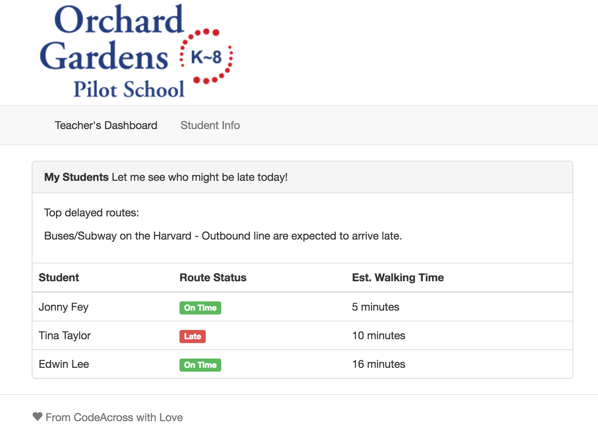

## Dudley Late

The DSNI app from CodeAcross 2016. This app provides a dashboard to allow school administrators to track if MBTA outages
and delays will cause a student's tardiness.

Currently many schools count a student as absent if they are late too often. So a student who is delayed because of transit
issues may decide to skip entirely since they will be marked absent anyway. This app provides information to administrators 
to grant 'excused' tardies to help try and turn this situation around.

Clone the repo

    git clone git@github.com:codeforboston/dudley_late.git

First install [node.js](https://nodejs.org/en/).

You may also need to install bower which you can do with NPM

    npm install -g bower

    cd <path to where you cloned the project>

    npm install
    bower install

Then you can serve the project with

    grunt serve

If everything worked a browser window should open on port 9000 and you should see the dashboard.

